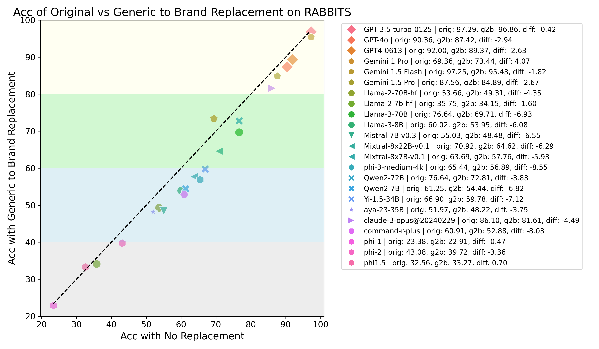

# RABBITS: Robust Assessment of Biomedical Benchmarks Involving drug Term Substitutions

<!-- exclude_docs -->
[](./LICENSE.txt)
[](https://arxiv.org/abs/2406.12066)
[](https://huggingface.co/spaces/AIM-Harvard/rabbits-leaderboard)


<!-- exclude_docs_end -->

**RABBITS** is a dataset transformation project that focuses on evaluating the robustness of language models in the medical **domain** through the substitution of brand names for generic drugs and vice versa. This evaluation is crucial as medical prescription errors, often related to incorrect drug naming, are a leading cause of morbidity and mortality.



## Motivation

Medical knowledge is context-dependent and requires consistent reasoning across various natural language expressions of semantically equivalent phrases. This is particularly crucial for drug names, where patients often use brand names like Advil or Tylenol instead of their generic equivalents. To study this, we create a new robustness dataset, RABBITS, to evaluate performance differences on medical benchmarks after swapping brand and generic drug names using physician expert annotations.

By modifying common medical benchmarks such as MedMCQA and MedQA, and replacing drug names, we aim to:

- Test models' robustness in clinical knowledge comprehension.
- Detect signs of dataset contamination or model bias.
- Highlight the importance of precise drug nomenclature in medical AI applications.

Our findings reveal a consistent performance drop ranging from 1-10% when drug names are swapped, suggesting potential issues in the model's ability to generalize and highlighting the need for robustness in medical AI applications.

## Setup

### Environment

The codebase is designed to run with Python 3.9. Here are the steps to set up the environment:

```bash
conda create -n rabbits python=3.9
conda activate rabbits
pip install -r requirements.txt
```

## Datasets

The following datasets are transformed and analyzed in the RABBITS project:

1. MedQA (medqa)
2. MedMCQA (medmcqa)

Each dataset is processed to create three subsets: a subset that is filtered to questions that contain a drug keyword then two other variants, one with brand names replaced by generic names and another with generic names replaced by brand names. These transformations test the model's ability to maintain accuracy despite changes in clinically equivalent terminology.


## Drug Names
`src/get_full_drugs.ipynb` - creates the final list of brand and generic drug pairs using the `RxNorm` dataset. It also includes the api calls to check brand names for each generic drug which was used during the quality assurance process.
`src/generic_to_brand.csv` - contains the final list of generic to brand drug names
`src/filter_drug_names.ipynb` - filters the drug names to only include those questions that were accepted during the quality assurance process

## Keyword Extraction
`src/drug_mapping` - contains the code to create brand-generic drug mappings
`src/run_filtering.py` - runs the keyword extraction and filters the datasets to only entries that contain either a brand or generic drug name
`src/run_replacement.py` - runs the keyword replacement on the filtered datasets
`src/counts_per_col.py` - counts the number of times each word appears in each column of the dataset e.g. question vs answers

## Results
`src/create_benchmarks.py` - creates a benchmark for Hugging Face and pushes it to the hub
`RABBITS_figs.ipynb` - contains the code to create the figures in the paper

# Citing
```
@article{gallifant2024rabbits,
  title={Language Models are Surprisingly Fragile to Drug Names in Biomedical Benchmarks},
  author={Gallifant, Jack and Chen, Shan and Moreira, Pedro and Munch, Nikolaj and Gao, Mingye and Pond, Jackson and Aerts, Hugo and Celi, Leo Anthony and Hartvigsen, Thomas and Bitterman, Danielle S.},
  journal={arXiv preprint arXiv:2406.12066v1 [cs.CL]},
  year={2024},
  note={17 Jun 2024}
}
```
